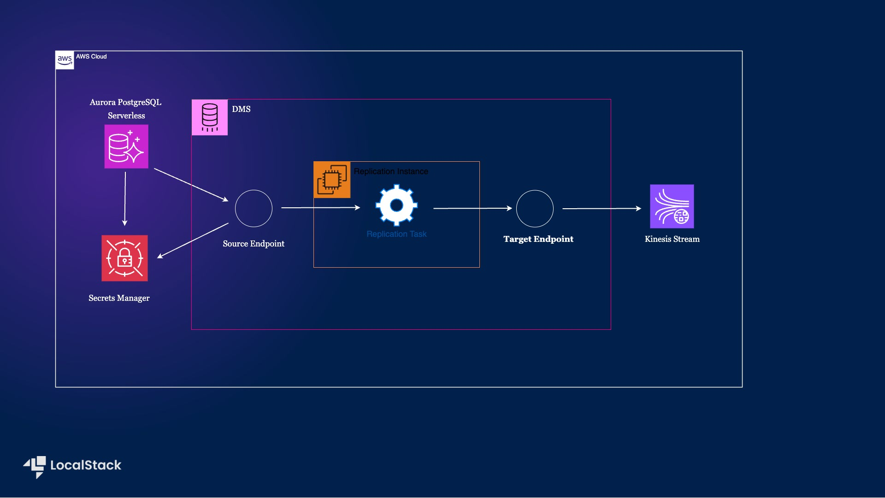

# Sample Application showcasing how to use DMS to create CDC with Aurora PostgreSQL source and kinesis target

## Introduction

This scenario demonstrates how to use Database Migration Service (DMS) to create change data capture (CDC) tasks using the Cloud Development Kit in Python. It is a self-contained setup that will create a VPC to host the DMS replication instance, a database, a Kinesis stream, and a replication task.



## Pre-requisites

-   [LocalStack Auth Token](https://docs.localstack.cloud/getting-started/auth-token/)
-   [Python 3.10](https://www.python.org/downloads/) & `pip`
-   [Docker Compose](https://docs.docker.com/compose/install/)
-   [CDK](https://docs.localstack.cloud/user-guide/integrations/aws-cdk/)  with the  [`cdklocal`](https://github.com/localstack/aws-cdk-local) wrapper.

  
Start LocalStack Pro with the `LOCALSTACK_AUTH_TOKEN`  pre-configured:

```bash
export LOCALSTACK_AUTH_TOKEN=<your-auth-token>
docker-compose up
```

The Docker Compose file will start LocalStack Pro container and a Postgres container. The Postgres container will be used to showcase how to reach a database external to LocalStack.

## Instructions

### Install the dependencies

Install all the dependencies by running the following command:

```bash
make install
```

### Creating the infrastructure

To deploy the infrastructure, you can run the following command:

```bash
make deploy
```

> NOTE: By default we create the kinesis target endpoint with default settings.
> For non-default settings we enable capturing events related to DDL operations and 
> include `NULL` and empty column values from the events.
> In order to create the target with non-default values set the environment to `KINESIS_TARGET=non-default`. 
> To know more about these settings, checkout the [official AWS documentation](https://docs.aws.amazon.com/dms/latest/userguide/CHAP_Target.Kinesis.html#:~:text=Kinesis%20Data%20Streams%20endpoint%20settings).

After successful deployment, you will see the following output:

```bash
Outputs:
DMsSampleSetupStack.cdcTask = arn:aws:dms:us-east-1:000000000000:task:F6V3I917K2919C2HGVXCKE8O8AY19SX7M4TZH2U
DMsSampleSetupStack.dbSecret = arn:aws:secretsmanager:us-east-1:000000000000:secret:DMsSampleSetupStack-postgressecret-cb6c3bd1-vgGron
DMsSampleSetupStack.kinesisStream = arn:aws:kinesis:us-east-1:000000000000:stream/DMsSampleSetupStack-TargetStream3B4B2880-1d69ef19
Stack ARN:
arn:aws:cloudformation:us-east-1:000000000000:stack/DMsSampleSetupStack/8f4fb494

✨  Total time: 45.06s
```

### Running the tasks

You can run the tasks by executing the following command:

```bash
make run
```

## Developer Notes

A replication task gets deployed with the stack:

A CDC replication task runs against the RDS database:

-   Creates three tables: `authors`, `accounts`, `books`
-   Starts CDC replication task
-   Captures and logs 4 Kinesis events: 1 for `awsdms_apply_exceptions` table, 3 for our tables
-   Makes 3 inserts
-   Captures and logs 3 Kinesis events
-   Makes 3 table alterations, 1 per table
-   Captures and logs 3 Kinesis events for non-default settings else 0
-   Logs `table_statistics` for the task

## Deploying on AWS

You can deploy and run the stack on AWS by running the following commands:

```bash
make deploy-aws
make run-aws
```

## License

This project is licensed under the Apache 2.0 License.
